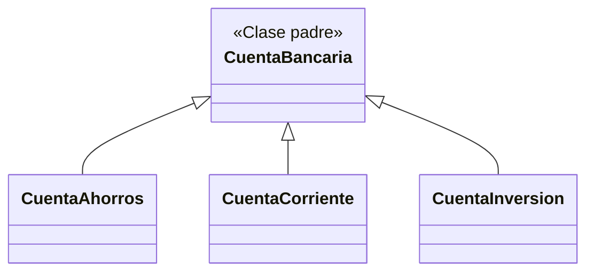

<div align="center">


### Tres tipos de cuenta. Tres reglas de negocio. Una sola base de código.

**Sistema Bancario** modela las operaciones del *Banco Nacional Andino* en **Java**, aplicando los cinco principios fundamentales de la Programación Orientada a Objetos.

<br>


<br>

[🎯 El contexto](#-el-contexto) · [🏦 Las cuentas](#-las-tres-cuentas) · [🧱 Arquitectura](#-arquitectura-de-clases) · [🧠 POO](#-los-5-principios-de-poo) · [🚀 Ejecutarlo](#-ejecutarlo-en-local)

</div>

<br>

<details>
<summary><b>👆 Haz clic: ¿qué demuestra este proyecto en 3 líneas?</b></summary>

<br>

1. 🧬 **Una clase padre** define lo común a todas las cuentas bancarias.
2. 🎛️ **Tres clases hijas** cambian las reglas de comisiones y retiros según el producto.
3. 🔁 **Mismo mensaje, distinto resultado:** retirar dinero se comporta diferente en cada cuenta. Eso es polimorfismo.

</details>

<br>

---

## 🎯 El contexto

Un banco no maneja un solo tipo de cuenta, y cada una tiene sus propias reglas. Si cada producto se programara por separado, el código se repetiría y cualquier cambio habría que hacerlo tres veces.

Este proyecto resuelve ese problema con **herencia y polimorfismo**: lo común vive en un solo lugar, y lo que cambia vive en cada cuenta.

---

## 🏦 Las tres cuentas

| | 💰 Cuenta de Ahorros | 🏢 Cuenta Corriente | 📈 Cuenta de Inversión |
|---|---|---|---|
| **Pensada para** | Ahorro personal | Empresas | Capital a largo plazo |
| **Intereses** | Mensuales | — | Tasa superior |
| **Comisión** | Ninguna en retiros normales | Fija por cada transacción | Penalización por retiro anticipado |
| **Regla especial** | Penaliza si el saldo restante cae bajo el mínimo permitido | Permite saldo negativo hasta un límite de sobregiro autorizado | Fondos bloqueados por un plazo fijado en meses |

---

## 🧱 Arquitectura de clases



`CuentaBancaria` concentra lo que todas las cuentas comparten. Cada clase hija **hereda** esa base y agrega o modifica solo lo que la distingue.

---

## 🧠 Los 5 principios de POO

| Principio | Qué significa en este proyecto |
|---|---|
| 🔒 **Encapsulamiento** | Los datos de la cuenta se protegen y solo se modifican a través de métodos controlados |
| 🧬 **Herencia** | Ahorros, Corriente e Inversión reutilizan todo lo definido en `CuentaBancaria` |
| 🎭 **Polimorfismo** | Una misma operación (por ejemplo, retirar) se comporta distinto según el tipo de cuenta |
| ♻️ **Sobreescritura** | Cada cuenta redefine el comportamiento heredado para aplicar sus propias reglas |
| 🔀 **Sobrecarga** | Métodos con el mismo nombre y distintos parámetros para cubrir variantes de una operación |

---

## 🚀 Ejecutarlo en local

Proyecto de consola desarrollado en **IntelliJ IDEA**:

```bash
git clone https://github.com/PaulJonaDev/BankingSystem.git
```

1. Abre la carpeta del proyecto en **IntelliJ IDEA**.
2. Espera a que el IDE indexe el proyecto.
3. Ejecuta la clase que contiene el método `main`.

---

## 🛠️ Siguientes pasos

- [ ] Pruebas unitarias para validar las reglas de cada cuenta
- [ ] Persistencia de datos (hoy todo vive en memoria durante la ejecución)
- [ ] Una interfaz gráfica o web para operar las cuentas

---

<div align="center">

Hecho por **Jonathan David Paul Caraballo** · [GitHub](https://github.com/PaulJonaDev) · [LinkedIn](https://www.linkedin.com/in/pauljonadev)

</div>
